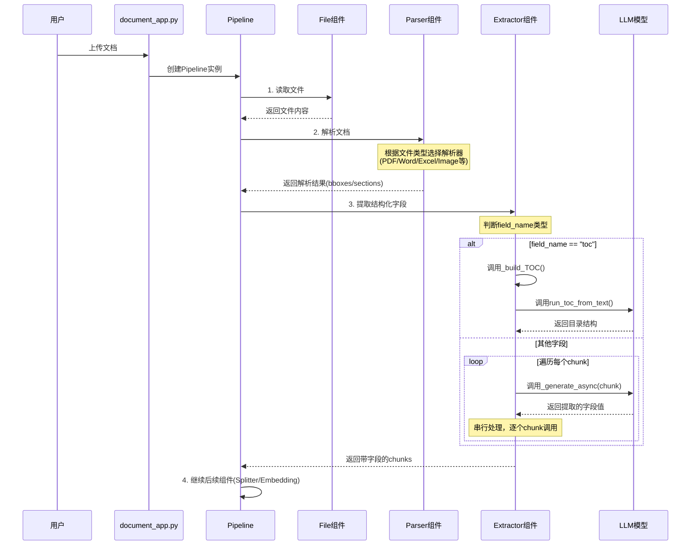

# RAGFlow Pipeline 执行流程深度分析

## 目录
1. [Pipeline 执行流程图](#1-pipeline-执行流程图)
2. [gen_metadata() 调用时机和方式](#2-gen_metadata-调用时机和方式)
3. [并行/串行机制分析](#3-并行串行机制分析)
4. [结构化提取与向量化的关系](#4-结构化提取与向量化的关系)
5. [数据存储机制](#5-数据存储机制)
6. [代码示例和关键代码片段](#6-代码示例和关键代码片段)

---

## 1. Pipeline 执行流程图

### 1.1 整体架构

```
文档上传 (document_app.py)
    ↓
Pipeline 初始化 (pipeline.py)
    ↓
┌─────────────────────────────────────────────────────────┐
│                    Pipeline.run()                        │
│                                                          │
│  File → Parser → Extractor → Splitter → Embedding       │
│   ↓       ↓         ↓           ↓           ↓           │
│  读取   解析文档   提取字段    分块处理    向量化        │
└─────────────────────────────────────────────────────────┘
    ↓
存储到向量数据库 (Elasticsearch/Infinity)
```

### 1.2 详细时序图



## 2. gen_metadata() 调用时机和方式

### 2.1 调用位置

**关键发现：`gen_metadata()` 不是在 Extractor 中直接调用的！**

根据代码分析：

1. **`gen_metadata()` 函数位置**：`rag/prompts/generator.py:873-884`
   ```python
   async def gen_metadata(chat_mdl, schema: dict, content: str):
       template = PROMPT_JINJA_ENV.from_string(META_DATA)
       # ... 处理schema
       system_prompt = template.render(content=content, schema=schema)
       user_prompt = "Output: "
       _, msg = message_fit_in(form_message(system_prompt, user_prompt), chat_mdl.max_length)
       ans = await chat_mdl.async_chat(msg[0][\"content\"], msg[1:])
       return re.sub(r\"^.*</think>\", \"\", ans, flags=re.DOTALL)
   ```

2. **Extractor 组件的实际实现**：`rag/flow/extractor/extractor.py:73-110`
   - Extractor 使用的是 `_generate_async()` 方法（继承自 LLM 组件）
   - **不是直接调用 `gen_metadata()`**

### 2.2 Extractor 的执行流程

```python
# rag/flow/extractor/extractor.py
async def _invoke(self, **kwargs):
    self.set_output("output_format", "chunks")
    inputs = self.get_input_elements()
    chunks = []

    # 获取输入的chunks
    for k, v in inputs.items():
        args[k] = v["value"]
        if isinstance(args[k], list):
            chunks = deepcopy(args[k])
            chunks_key = k

    if chunks:
        if self._param.field_name == "toc":
            # 特殊处理：生成目录
            toc = await self._build_TOC(chunks)
            chunks.append(toc)
        else:
            # 通用字段提取：串行处理每个chunk
            prog = 0
            for i, ck in enumerate(chunks):
                args[chunks_key] = ck["text"]
                msg, sys_prompt = self._sys_prompt_and_msg([], args)
                msg.insert(0, {"role": "system", "content": sys_prompt})

                # 关键：调用 _generate_async() 而不是 gen_metadata()
                ck[self._param.field_name] = await self._generate_async(msg)

                prog += 1./len(chunks)
                if i % (len(chunks)//100+1) == 1:
                    self.callback(prog, f"{i+1} / {len(chunks)}")

            self.set_output("chunks", chunks)
```

### 2.3 调用时机总结

| 问题 | 答案 |
|------|------|
| **在哪个环节调用？** | 在 **Parser 之后、Embedding 之前** 作为独立的 Extractor 组件调用 |
| **是否立即调用？** | 不是立即调用，而是作为 Pipeline 中的一个可选组件 |
| **调用方式** | 通过 `_generate_async()` 方法（继承自 LLM 组件），而不是直接调用 `gen_metadata()` |
| **是否必须？** | 否，Extractor 是可选组件，只有在 Pipeline DSL 中配置了才会执行 |

---

## 3. 并行/串行机制分析

### 3.1 Extractor 的串行处理

**关键发现：Extractor 对多个 chunks 是 **串行处理**，不是并行！**

```python
# rag/flow/extractor/extractor.py:96-104
for i, ck in enumerate(chunks):
    args[chunks_key] = ck["text"]
    msg, sys_prompt = self._sys_prompt_and_msg([], args)
    msg.insert(0, {"role": "system", "content": sys_prompt})

    # 串行调用，逐个处理
    ck[self._param.field_name] = await self._generate_async(msg)

    prog += 1./len(chunks)
    if i % (len(chunks)//100+1) == 1:
        self.callback(prog, f"{i+1} / {len(chunks)}")
```

**为什么是串行？**
- 使用 `for` 循环 + `await`，每次等待上一个完成后才处理下一个
- 没有使用 `asyncio.gather()` 或 `asyncio.create_task()`
- 有进度回调，需要按顺序更新进度

### 3.2 TOC 生成的并行处理

**对比：TOC 生成使用了并行机制！**

```python
# rag/prompts/generator.py:768-791
async def run_toc_from_text(chunks, chat_mdl, callback=None):
    # 将chunks分批
    chunk_sections = split_chunks(chunks, input_budget)

    chunks_res = []
    tasks = []

    # 创建并行任务
    for i, chunk in enumerate(chunk_sections):
        if not chunk:
            continue
        chunks_res.append({"chunks": chunk})
        tasks.append(asyncio.create_task(gen_toc_from_text(chunks_res[-1], chat_mdl, callback)))

    try:
        # 并行执行所有任务
        await asyncio.gather(*tasks, return_exceptions=False)
    except Exception as e:
        logging.error(f"Error generating TOC: {e}")
        for t in tasks:
            t.cancel()
        await asyncio.gather(*tasks, return_exceptions=True)
        raise
```

### 3.3 并行 vs 串行对比表

| 特性 | Extractor 字段提取 | TOC 生成 | Parser 图片处理 |
|------|-------------------|----------|----------------|
| **处理方式** | 串行 (for + await) | 并行 (asyncio.gather) | 并行 (asyncio.gather) |
| **代码位置** | extractor.py:96-104 | generator.py:768-791 | parser.py:803-813 |
| **原因** | 需要进度回调、顺序处理 | 提高效率、批量处理 | 提高效率、图片独立 |
| **性能影响** | 慢（N个chunk = N倍时间） | 快（并行处理） | 快（并行处理） |

### 3.4 性能分析

假设处理 100 个 chunks，每个 LLM 调用耗时 2 秒：

- **串行处理（Extractor）**：100 × 2s = **200 秒**
- **并行处理（TOC）**：假设并发度为 10，则 100 / 10 × 2s = **20 秒**

**结论：Extractor 的串行处理是性能瓶颈！**

---

## 4. 结构化提取与向量化的关系

### 4.1 Pipeline 组件顺序

```
File → Parser → Extractor → Splitter → Embedding → Storage
```

### 4.2 两者的关系

| 维度 | 结构化提取 (Extractor) | 向量化 (Embedding) |
|------|----------------------|-------------------|
| **执行顺序** | 先执行 | 后执行 |
| **输入** | Parser 输出的 chunks | Extractor 输出的 chunks |
| **输出** | 带结构化字段的 chunks | 带向量的 chunks |
| **是否独立** | 是，可选组件 | 是，可选组件 |
| **是否互斥** | 否，可以同时存在 | 否，可以同时存在 |

### 4.3 数据流转示例

```python
# 1. Parser 输出
parser_output = [
    {"text": "第一章 引言", "page_num": 1},
    {"text": "第二章 方法", "page_num": 2}
]

# 2. Extractor 添加字段
extractor_output = [
    {
        "text": "第一章 引言",
        "page_num": 1,
        "category": "introduction",  # Extractor 提取的字段
        "importance": "high"          # Extractor 提取的字段
    },
    {
        "text": "第二章 方法",
        "page_num": 2,
        "category": "methodology",
        "importance": "medium"
    }
]

# 3. Embedding 添加向量
embedding_output = [
    {
        "text": "第一章 引言",
        "page_num": 1,
        "category": "introduction",
        "importance": "high",
        "vector": [0.1, 0.2, ..., 0.9]  # Embedding 生成的向量
    },
    ...
]
```

### 4.4 提取的字段是否被向量化？

**答案：不会！**

- **向量化的内容**：只有 `text` 字段（或 `content_with_weight`）
- **结构化字段**：作为元数据存储，不参与向量化
- **检索时**：
  - 向量检索：使用 `vector` 字段
  - 元数据过滤：使用结构化字段（如 `category`, `importance`）

```python
# 检索示例（伪代码）
results = vector_db.search(
    query_vector=query_embedding,
    filters={
        "category": "introduction",  # 使用结构化字段过滤
        "importance": "high"
    },
    top_k=10
)
```

## 5. 数据存储机制

### 5.1 存储位置

提取的结构化字段存储在 **chunk 的元数据中**，与 chunk 一起存储到向量数据库。

### 5.2 存储结构

```python
# Chunk 的完整结构
chunk = {
    # 基础字段
    "id": "chunk_id_123",
    "doc_id": "document_id_456",
    "kb_id": "knowledgebase_id_789",
    "text": "这是文档的内容...",
    "content_with_weight": "这是文档的内容...",

    # 位置信息
    "page_num_int": [1],
    "top_int": [100],
    "positions": [[1, 0.1, 0.9, 0.1, 0.2]],

    # 文档类型
    "doc_type_kwd": "text",  # 或 "image", "table"

    # 向量
    "vector": [0.1, 0.2, ..., 0.9],

    # Extractor 提取的结构化字段（动态添加）
    "category": "introduction",      # 自定义字段1
    "importance": "high",            # 自定义字段2
    "author": "张三",                # 自定义字段3
    "date": "2024-01-01",           # 自定义字段4

    # 特殊字段：TOC
    "toc_kwd": "toc",               # 标记为目录chunk
    "available_int": 0,             # 不参与检索
}
```

### 5.3 存储代码分析

```python
# rag/flow/extractor/extractor.py:101
ck[self._param.field_name] = await self._generate_async(msg)
```

**关键点：**
- 直接将提取的字段值赋给 chunk 字典
- 字段名由 `self._param.field_name` 指定
- 字段值由 LLM 生成

### 5.4 TOC 的特殊存储

```python
# rag/flow/extractor/extractor.py:62-70
if toc:
    d = deepcopy(docs[-1])
    d["doc_id"] = self._canvas._doc_id
    d["content_with_weight"] = json.dumps(toc, ensure_ascii=False)
    d["toc_kwd"] = "toc"                    # 标记为TOC
    d["available_int"] = 0                  # 不参与检索
    d["page_num_int"] = [100000000]         # 排序到最后
    d["id"] = xxhash.xxh64((d["content_with_weight"] + str(d["doc_id"])).encode("utf-8", "surrogatepass")).hexdigest()
    return d
```

**TOC 的特殊性：**
- 作为单独的 chunk 存储
- `toc_kwd = "toc"` 标记
- `available_int = 0` 不参与向量检索
- `page_num_int = [100000000]` 排序到最后
- `content_with_weight` 存储 JSON 格式的目录结构

### 5.5 是否影响向量检索？

**答案：不直接影响，但可以用于过滤！**

1. **向量检索**：
   - 只使用 `vector` 字段进行相似度计算
   - 结构化字段不参与向量检索

2. **元数据过滤**：
   - 可以在检索时使用结构化字段进行过滤
   - 例如：`category = "introduction" AND importance = "high"`

3. **检索示例**：

```python
# 伪代码：向量检索 + 元数据过滤
results = vector_db.search(
    query_vector=query_embedding,
    filters={
        "category": {"$eq": "introduction"},
        "importance": {"$in": ["high", "medium"]},
        "date": {"$gte": "2024-01-01"}
    },
    top_k=10
)
```

### 5.6 存储到哪个表？

根据代码分析，chunks 存储在：

- **Elasticsearch**：`{tenant_id}_{kb_id}` 索引
- **Infinity**：类似的表结构

**存储流程：**
```
Extractor 输出 chunks
    ↓
Embedding 添加向量
    ↓
Storage 组件
    ↓
写入向量数据库（Elasticsearch/Infinity）
```

---

## 6. 代码示例和关键代码片段

### 6.1 Extractor 组件完整实现

```python
# rag/flow/extractor/extractor.py
class Extractor(ProcessBase, LLM):
    component_name = "Extractor"

    async def _build_TOC(self, docs):
        """生成目录结构"""
        self.callback(0.2, message="Start to generate table of content ...")

        # 按页码和位置排序
        docs = sorted(docs, key=lambda d:(
            d.get("page_num_int", 0)[0] if isinstance(d.get("page_num_int", 0), list) else d.get("page_num_int", 0),
            d.get("top_int", 0)[0] if isinstance(d.get("top_int", 0), list) else d.get("top_int", 0)
        ))

        # 调用 LLM 生成目录
        toc = await run_toc_from_text([d["text"] for d in docs], self.chat_mdl)
        logging.info("------------ T O C -------------\\n"+json.dumps(toc, ensure_ascii=False, indent='  '))

        # 将目录项映射到chunk ID
        ii = 0
        while ii < len(toc):
            try:
                idx = int(toc[ii]["chunk_id"])
                del toc[ii]["chunk_id"]
                toc[ii]["ids"] = [docs[idx]["id"]]
                if ii == len(toc) -1:
                    break
                for jj in range(idx+1, int(toc[ii+1]["chunk_id"])+1):
                    toc[ii]["ids"].append(docs[jj]["id"])
            except Exception as e:
                logging.exception(e)
            ii += 1

        # 创建TOC chunk
        if toc:
            d = deepcopy(docs[-1])
            d["doc_id"] = self._canvas._doc_id
            d["content_with_weight"] = json.dumps(toc, ensure_ascii=False)
            d["toc_kwd"] = "toc"
            d["available_int"] = 0
            d["page_num_int"] = [100000000]
            d["id"] = xxhash.xxh64((d["content_with_weight"] + str(d["doc_id"])).encode("utf-8", "surrogatepass")).hexdigest()
            return d
        return None

    async def _invoke(self, **kwargs):
        self.set_output("output_format", "chunks")
        self.callback(random.randint(1, 5) / 100.0, "Start to generate.")

        # 获取输入
        inputs = self.get_input_elements()
        chunks = []
        chunks_key = ""
        args = {}
        for k, v in inputs.items():
            args[k] = v["value"]
            if isinstance(args[k], list):
                chunks = deepcopy(args[k])
                chunks_key = k

        if chunks:
            # 特殊处理：生成目录
            if self._param.field_name == "toc":
                for ck in chunks:
                    ck["doc_id"] = self._canvas._doc_id
                    ck["id"] = xxhash.xxh64((ck["text"] + str(ck["doc_id"])).encode("utf-8")).hexdigest()
                toc = await self._build_TOC(chunks)
                chunks.append(toc)
                self.set_output("chunks", chunks)
                return

            # 通用字段提取：串行处理
            prog = 0
            for i, ck in enumerate(chunks):
                args[chunks_key] = ck["text"]
                msg, sys_prompt = self._sys_prompt_and_msg([], args)
                msg.insert(0, {"role": "system", "content": sys_prompt})

                # 调用 LLM 提取字段
                ck[self._param.field_name] = await self._generate_async(msg)

                prog += 1./len(chunks)
                if i % (len(chunks)//100+1) == 1:
                    self.callback(prog, f"{i+1} / {len(chunks)}")

            self.set_output("chunks", chunks)
        else:
            # 没有chunks，直接生成
            msg, sys_prompt = self._sys_prompt_and_msg([], args)
            msg.insert(0, {"role": "system", "content": sys_prompt})
            self.set_output("chunks", [{self._param.field_name: await self._generate_async(msg)}])
```

### 6.2 gen_metadata() 函数实现

```python
# rag/prompts/generator.py:873-884
async def gen_metadata(chat_mdl, schema: dict, content: str):
    """
    从内容中提取结构化元数据

    Args:
        chat_mdl: LLM 模型实例
        schema: JSON Schema 定义的字段结构
        content: 要提取的文本内容

    Returns:
        str: LLM 生成的结构化数据（JSON 格式）
    """
    template = PROMPT_JINJA_ENV.from_string(META_DATA)

    # 处理 schema 中的 enum
    for k, desc in schema["properties"].items():
        if "enum" in desc and not desc.get("enum"):
            del desc["enum"]
        if desc.get("enum"):
            desc["description"] += "\\n** Extracted values must strictly match the given list specified by `enum`. **"

    # 渲染 prompt
    system_prompt = template.render(content=content, schema=schema)
    user_prompt = "Output: "

    # 调用 LLM
    _, msg = message_fit_in(form_message(system_prompt, user_prompt), chat_mdl.max_length)
    ans = await chat_mdl.async_chat(msg[0]["content"], msg[1:])

    # 清理输出
    return re.sub(r"^.*</think>", "", ans, flags=re.DOTALL)
```

### 6.3 Pipeline 执行流程

```python
# rag/flow/pipeline.py:117-175
async def run(self, **kwargs):
    """Pipeline 主执行流程"""
    log_key = f"{self._flow_id}-{self.task_id}-logs"
    try:
        REDIS_CONN.set_obj(log_key, [], 60 * 10)
    except Exception as e:
        logging.exception(e)

    self.error = ""

    # 1. 初始化：从 File 组件开始
    if not self.path:
        self.path.append("File")
        cpn_obj = self.get_component_obj(self.path[0])
        await cpn_obj.invoke(**kwargs)
        if cpn_obj.error():
            self.error = "[ERROR]" + cpn_obj.error()
            self.callback(cpn_obj.component_name, -1, self.error)

    # 2. 更新进度
    if self._doc_id:
        TaskService.update_progress(self.task_id, {
            "progress": random.randint(0, 5) / 100.0,
            "progress_msg": "Start the pipeline...",
            "begin_at": datetime.datetime.now().strftime("%Y-%m-%d %H:%M:%S")
        })

    # 3. 顺序执行组件
    idx = len(self.path) - 1
    cpn_obj = self.get_component_obj(self.path[idx])
    idx += 1
    self.path.extend(cpn_obj.get_downstream())

    while idx < len(self.path) and not self.error:
        last_cpn = self.get_component_obj(self.path[idx - 1])
        cpn_obj = self.get_component_obj(self.path[idx])

        # 调用组件
        async def invoke():
            nonlocal last_cpn, cpn_obj
            await cpn_obj.invoke(**last_cpn.output())

        tasks = []
        tasks.append(asyncio.create_task(invoke()))
        await asyncio.gather(*tasks)

        # 检查错误
        if cpn_obj.error():
            self.error = "[ERROR]" + cpn_obj.error()
            self.callback(cpn_obj._id, -1, self.error)
            break

        idx += 1
        self.path.extend(cpn_obj.get_downstream())

    # 4. 完成
    self.callback("END", 1 if not self.error else -1,
                  json.dumps(self.get_component_obj(self.path[-1]).output(), ensure_ascii=False))

    if not self.error:
        return self.get_component_obj(self.path[-1]).output()

    TaskService.update_progress(self.task_id, {
        "progress": -1,
        "progress_msg": f"[ERROR]: {self.error}"
    })

    return {}
```

### 6.4 TOC 并行生成示例

```python
# rag/prompts/generator.py:768-837
async def run_toc_from_text(chunks, chat_mdl, callback=None):
    """
    从文本chunks生成目录结构（并行处理）

    Args:
        chunks: 文本chunks列表
        chat_mdl: LLM模型实例
        callback: 进度回调函数

    Returns:
        list: 目录结构列表
    """
    # 1. 计算输入预算
    input_budget = int(chat_mdl.max_length * INPUT_UTILIZATION) - num_tokens_from_string(
        TOC_FROM_TEXT_USER + TOC_FROM_TEXT_SYSTEM
    )
    input_budget = 1024 if input_budget > 1024 else input_budget

    # 2. 分批处理
    chunk_sections = split_chunks(chunks, input_budget)
    titles = []

    # 3. 创建并行任务
    chunks_res = []
    tasks = []
    for i, chunk in enumerate(chunk_sections):
        if not chunk:
            continue
        chunks_res.append({"chunks": chunk})
        tasks.append(asyncio.create_task(gen_toc_from_text(chunks_res[-1], chat_mdl, callback)))

    # 4. 并行执行
    try:
        await asyncio.gather(*tasks, return_exceptions=False)
    except Exception as e:
        logging.error(f"Error generating TOC: {e}")
        for t in tasks:
            t.cancel()
        await asyncio.gather(*tasks, return_exceptions=True)
        raise

    # 5. 合并结果
    for chunk in chunks_res:
        titles.extend(chunk.get("toc", []))

    # 6. 过滤和清理
    prune = len(titles) > 512
    max_len = 12 if prune else 22
    filtered = []
    for x in titles:
        if not isinstance(x, dict) or not x.get("title") or x["title"] == "-1":
            continue
        if len(rag_tokenizer.tokenize(x["title"]).split(" ")) > max_len:
            continue
        if re.match(r"[0-9,.()/ -]+$", x["title"]):
            continue
        filtered.append(x)

    logging.info(f"\\n\\nFiltered TOC sections:\\n{filtered}")
    if not filtered:
        return []

    # 7. 分配层级
    raw_structure = [x.get("title", "") for x in filtered]
    toc_with_levels = await assign_toc_levels(raw_structure, chat_mdl, {"temperature": 0.0, "top_p": 0.9})
    if not toc_with_levels:
        return []

    # 8. 合并结构和内容
    prune = len(toc_with_levels) > 512
    max_lvl = "0"
    sorted_list = sorted([t.get("level", "0") for t in toc_with_levels if isinstance(t, dict)])
    if sorted_list:
        max_lvl = sorted_list[-1]

    merged = []
    for _, (toc_item, src_item) in enumerate(zip(toc_with_levels, filtered)):
        if prune and toc_item.get("level", "0") >= max_lvl:
            continue
        merged.append({
            "level": toc_item.get("level", "0"),
            "title": toc_item.get("title", ""),
            "chunk_id": src_item.get("chunk_id", ""),
        })

    return merged
```

### 6.5 使用示例：如何配置 Extractor 提取多个字段

```python
# 示例1：提取单个字段
extractor_config = {
    "component_name": "Extractor",
    "field_name": "category",  # 提取类别字段
    "llm_id": "llm_model_id",
    "sys_prompt": "Extract the category from the following text:",
    "prompts": [
        {"role": "user", "content": "{text}"}
    ]
}

# 示例2：提取多个字段（需要多个Extractor组件）
pipeline_dsl = {
    "components": [
        {
            "id": "parser_1",
            "component_name": "Parser",
            "downstream": ["extractor_category"]
        },
        {
            "id": "extractor_category",
            "component_name": "Extractor",
            "field_name": "category",
            "downstream": ["extractor_importance"]
        },
        {
            "id": "extractor_importance",
            "component_name": "Extractor",
            "field_name": "importance",
            "downstream": ["extractor_author"]
        },
        {
            "id": "extractor_author",
            "component_name": "Extractor",
            "field_name": "author",
            "downstream": ["embedding"]
        },
        {
            "id": "embedding",
            "component_name": "Embedding"
        }
    ]
}

# 示例3：生成TOC
toc_extractor_config = {
    "component_name": "Extractor",
    "field_name": "toc",  # 特殊字段：生成目录
    "llm_id": "llm_model_id"
}
```

---

## 7. 总结与建议

### 7.1 关键发现

1. **gen_metadata() 不是直接调用的**
   - Extractor 使用 `_generate_async()` 方法
   - `gen_metadata()` 是一个独立的工具函数，可能在其他地方使用

2. **Extractor 是串行处理**
   - 对多个 chunks 逐个调用 LLM
   - 性能瓶颈：100 个 chunks 需要 200 秒（假设每次 2 秒）

3. **TOC 生成是并行处理**
   - 使用 `asyncio.gather()` 并行调用 LLM
   - 性能优化：100 个 chunks 只需 20 秒（假设并发度为 10）

4. **结构化字段不参与向量化**
   - 只有 `text` 字段被向量化
   - 结构化字段作为元数据存储，用于过滤

5. **Extractor 是可选组件**
   - 不是 Pipeline 的必须组件
   - 需要在 DSL 中显式配置

### 7.2 性能优化建议

1. **改进 Extractor 为并行处理**
   ```python
   # 当前：串行
   for i, ck in enumerate(chunks):
       ck[field_name] = await self._generate_async(msg)

   # 建议：并行
   tasks = []
   for i, ck in enumerate(chunks):
       tasks.append(asyncio.create_task(self._generate_async(msg)))
   results = await asyncio.gather(*tasks)
   for i, result in enumerate(results):
       chunks[i][field_name] = result
   ```

2. **批量处理**
   - 将多个 chunks 合并为一个请求
   - 减少 LLM 调用次数

3. **缓存机制**
   - 对相同内容的提取结果进行缓存
   - 避免重复调用 LLM

### 7.3 使用建议

1. **何时使用 Extractor**
   - 需要提取结构化字段时（如类别、作者、日期）
   - 需要生成目录结构时（field_name = "toc"）
   - 需要元数据过滤时

2. **何时不使用 Extractor**
   - 只需要向量检索时
   - 对性能要求极高时（因为是串行处理）
   - 文档数量很大时（会显著增加处理时间）

3. **最佳实践**
   - 只提取必要的字段
   - 使用简洁的 prompt
   - 考虑使用更快的 LLM 模型
   - 监控处理时间和成本

---

## 8. 参考资料

### 8.1 关键文件

- `rag/flow/pipeline.py` - Pipeline 执行流程
- `rag/flow/extractor/extractor.py` - Extractor 组件实现
- `rag/flow/parser/parser.py` - Parser 组件实现
- `rag/prompts/generator.py` - gen_metadata() 和 TOC 生成
- `agent/component/llm.py` - LLM 组件基类

### 8.2 相关概念

- **Pipeline**：组件的有向无环图（DAG），定义了文档处理流程
- **Component**：Pipeline 中的一个处理单元（如 Parser、Extractor、Embedding）
- **Chunk**：文档的一个片段，包含文本、元数据和向量
- **DSL**：领域特定语言，用于定义 Pipeline 的结构

### 8.3 扩展阅读

- RAGFlow 官方文档：https://github.com/infiniflow/ragflow
- asyncio 并发编程：https://docs.python.org/3/library/asyncio.html
- JSON Schema：https://json-schema.org/
